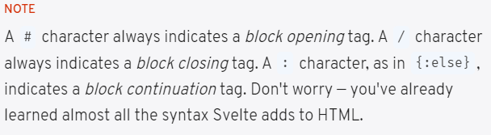

# Basic Svelte

In Svelte, an application is composed from one or more *components*. A component is a reusable self-contained block of code that encapsulates HTML, CSS and JavaScript that belong together, written into a `.svelte` file. 

```jsx
<script>
	let name = 'Ezequiel'
</script>

<!-- Markup -->
<h1>Hello {name}!</h1>
```

## Dynamic attributes

```jsx
<script>
	let src = '/image.gif'
</script>

<!-- Markup -->

 

```

## Styling

These rules are *scoped to the component*. You won't accidentally change the style of `<p>` elements elsewhere in your app.

```jsx
<script>
	let name = 'Ezequiel'
</script>

<!-- Markup -->
<p>Hello {name}!</p>

<style>
		p {
			color: goldenrod;
			font-family: 'Comic Sans MS', cursive;
			font-size: 2em;
	}
</style>
```

## Nested components

Data flow in Svelte is *top down* — a parent component can set props on a child component, and a component can set attributes on an element, but not the other way around.

Notice that even though `Nested.svelte` has a `<p>` element, the styles from `App.svelte` don't leak in.

```jsx
<script>
	import Nested from './Nested.svelte'
</script>

<p>This is a paragraph.</p>
<Nested />

<style>
	p {
		color: goldenrod;
		font-family: 'Comic Sans MS', cursive;
		font-size: 2em;
	}
</style>
```

## HTML tags

Ordinarily, strings are inserted as plain text, meaning that characters like `<` and `>` have no special meaning. But sometimes you need to render HTML directly into a component.

```jsx
<script>
	let string = `this string contains some <strong>HTML!!!</strong>`;
</script>

<p>{@html string}</p>
```

## Reactivity

First, wire up an event handler

```jsx
<button on:click={increment}></button>
```

And the function thats gona be fired when this event is called

```jsx
function increment() { }
```

```jsx
<script>
	let count = 0;

	function increment() {
		// event handler code goes here
		count++;
	}
</script>

<button on:click={increment}>
	Clicked {count}
	{count === 1 ? 'time' : 'times'}
</button>

```

### Declarations

Often, some parts of a component’s state need to be computed and recompunted whenever they change, those are called *reactive declarations.*

```jsx
*re-run this code whenever any of the referenced values change*

<script>
	let count = 0;
	$: doubled = count * 2
	function increment() {
		count += 1;
	}
</script>
```

Reactive values become particularly valuable (no pun intended) when you need to reference them multiple times, or you have values that depend on *other* reactive values.

### Statements

Reactive statements can be used to derive computed data or trigger side effects when something changes. Statements prefixed with a `$:` label are reactive. They'll be recomputed when data used in the reactive statement is updated.

```jsx
<script>
	export let title;
	export let person;

	// this will update `document.title` whenever
	// the `title` prop changes
	$: document.title = title;

	$: {
		console.log(`multiple statements can be combined`);
		console.log(`the current title is ${title}`);
	}

	// this will update `name` when 'person' changes
	$: ({ name } = person);

	// don't do this. it will run before the previous line
	let name2 = name;
</script>

```

### Props

To pass data from one component down to its children. To do that, we need to declare *properties*, generally shortened to 'props'. In Svelte, we do that with the `export` keyword.

```jsx
Nested.svelte
<script>
	export let answer;
</script>

<p>The answer is {answer}</p>

-----------------------------------

App.svelte
<script>
	import Nested from './Nested.svelte';
</script>

<Nested answer={42} />

```

### Speed props

Since the properties of `pkg` correspond to the component's expected props, we can 'spread' them onto the component instead:

```jsx

PackageInfo.svelte
<script>
	export let name;
	export let version;
	export let speed;
	export let website;
	
	$: href = `https://www.npmjs.com/package/${name}`;
</script>

<p>
	The <code>{name}</code> package is {speed} fast. Download version {version} from
	<a {href}>npm</a> and <a href={website}>learn more here</a>
</p>

----------------------------------------------------------------

App.svelte
<script>
	import PackageInfo from './PackageInfo.svelte';

	const pkg = {
		name: 'svelte',
		speed: 'blazing',
		version: 4,
		website: 'https://svelte.dev'
	};
</script>

<PackageInfo {...pkg} />

```

## Logic



### If, else and else-if blocks

To conditionally render some markup, we wrap it in an `if`

```jsx
<script>
	let count = 0;

	function increment() {
		count += 1;
	}
</script>

<button on:click={increment}>
	Clicked {count}
	{count === 1 ? 'time' : 'times'}
</button>

{#if count > 10}
	<p>{count} is greater than 10</p>
{/if}
```

```jsx
<script>
	let count = 0;

	function increment() {
		count += 1;
	}
</script>

<button on:click={increment}>
	Clicked {count}
	{count === 1 ? 'time' : 'times'}
</button>

{#if count > 10}
	<p>{count} is greater than 10</p>
{:else}
	<p>{count} is between 0 and 10</p>
{/if}
```

```jsx
<script>
	let count = 0;

	function increment() {
		count += 1;
	}
</script>

<button on:click={increment}>
	Clicked {count}
	{count === 1 ? 'time' : 'times'}
</button>

{#if count > 10}
	<p>{count} is greater than 10</p>
{:else if count < 5}
	<p>{count} is less than 5</p>
{:else}
	<p>{count} is between 0 and 10</p>
{/if}
```

### Each blocks

```jsx
<script>
	let cats = [
		{ id: 'J---aiyznGQ', name: 'Keyboard Cat' },
		{ id: 'z_AbfPXTKms', name: 'Maru' },
		{ id: 'OUtn3pvWmpg', name: 'Henri The Existential Cat' }
	];
</script>

<h1>The Famous Cats of YouTube</h1>

<ul>
	{#each cats as { id, name }, i}
		<li>
			({i + 1}) {id} -> {name}
		</li>
	{/each}
</ul>

```

### Keyed each blocks

We can specify a unique identifier (or "key") for each iteration of the `each` block.

```jsx
#each things as thing (thing.id)}
	<Thing name={thing.name}/>
{/each}
```

Here, `(thing.id)` is the *key*, which tells Svelte how to figure out what to update when the values (`name` in this example) change.

### Await blocks

```jsx
<script>
	import { getRandomNumber } from './utils.js';

	let promise = getRandomNumber();

	function handleClick() {
		promise = getRandomNumber();
	}
</script>

<button on:click={handleClick}>
	generate random number
</button>

{#await promise}
	<p>...waiting</p>
{:then res}
	<p>The number is {res}</p>
{:catch error}
	<p style="color: red">{error.message}</p>
{/await}
```

## Events

### DOM events

You can listen to any DOM even on an element with the `on:` directive.

```jsx
<script>
	let m = { x: 0, y: 0 };

	function handleMove(event) {
		m.x = event.clientX;
		m.y = event.clientY;
	}
</script>

<div on:pointermove={handleMove}>
	The pointer is at {m.x} x {m.y}
</div>
```

### Inline handlers

You can declare event handlers inline

```jsx
<script>
	let m = { x: 0, y: 0 };

	function handleMove(event) {
		m.x = event.clientX;
		m.y = event.clientY;
	}
</script>

<div on:pointermove={(e) => {
		m.x = e.clientX;
		m.y = e.clientY;
}}>
	The pointer is at {m.x} x {m.y}
</div>
```

### Component events

Components can also dispatch events, they must create an **event dispatcher:**

```jsx
Inner.svelte

<script>
	import { createEventDispatcher } from 'svelte';

	const dispatch = createEventDispatcher();

	function sayHello() {
		dispatch('message', {
			text: 'Hello!'
		});
	}
</script>

-----------------------------------------------------

App.svelte
<script>
	import Inner from './Inner.svelte';

	function handleMessage(event) {
		alert(event.detail.text);
	}
</script>

<Inner on:message={handleMessage}/>
```

### Event forwarding

If you want to listen to an event on some deeply nested component, the intermediate components must *forward* the event.

One way we *could* solve the problem is adding `createEventDispatcher` to `Outer.svelte`, listening for the `message` event, and creating a handler for it:

```jsx
Outer.svelte
<script>
	import Inner from './Inner.svelte';
	import { createEventDispatcher } from 'svelte';

	const dispatch = createEventDispatcher();

	function forward(event) {
		dispatch('message', event.detail);
	}
</script>

<Inner on:message={forward}/>
```

Svelte gives us an equivalent shorthand — an `on:message` event directive without a value means 'forward all `message` events'.

```jsx
Outer.svelte
<script>
	import Inner from './Inner.svelte';
</script>

<Inner on:message/>
```

### DOM event forwarding

Event forwarding works for DOM events too.

We want to get notified of clicks on our `<BigRedButton>` — to do that, we just need to forward `click` events on the `<button>` element

```jsx
App.svelte
<script>
	import BigRedButton from './BigRedButton.svelte';
	import horn from './horn.mp3';

	const audio = new Audio();
	audio.src = horn;

	function handleClick() {
		audio.load();
		audio.play();
	}
</script>

<BigRedButton on:click={handleClick} />

---------------------------------------------

BigRedButton.svelte
<button on:click>
	Push
</button>
```

## Stores

Stores are Svelte's way of managing state beyond local component state. Function that creates a store which has values that can be set from 'outside' components. It gets created as an object with additional `set` and `update` methods.

`set` is a method that takes one argument which is the value to be set. The store value gets set to the value of the argument if the store value is not already equal to it.

`update` is a method that takes one argument which is a callback. The callback takes the existing store value as its argument and returns the new value to be set to the store.

### Writable stores

 A `writable` store is a store that can be written to and read from Svelte components.

```jsx
stores.js
import { writable } from 'svelte/store';

export const count = writable(0);

-------------------------------------

Incrementor.svelte
<script>
	import { count } from './stores.js';

	function increment() {
		// TODO increment the count
		count.update((n) => n + 1);
	}
</script>

<button on:click={increment}>
	+
</button>

---------------------------------------------

Resetter.svelte
<script>
	import { count } from './stores.js';

	function reset() {
		// TODO reset the count
		count.set(0)
	}
</script>

<button on:click={reset}>
	reset
</button>

---------------------------------------

App.svelte

<script>
	import { count } from './stores.js';
	import Incrementer from './Incrementer.svelte';
	import Resetter from './Resetter.svelte';

	let count_value;

	count.subscribe((value) => {
		count_value = value;
	});
</script>

<h1>The count is {count_value}</h1>

<Incrementer />
<Resetter />
```

### Auto-subscriptions

Components can not unsubscribe from a stoire, if the component was instantiated and destroyed many times, this would result in a *memory leak.*

```jsx
Calling a subscribe method returns an unsubscribe function.

App.svelte

const unsubscribe = count.subscribe((value) => {
	count_value = value;
});
```

You now declared `unsubscribe`, but it still needs to be called, for example through the `onDestroy` lifecycle hook:

```jsx
<script>
	import { onDestroy } from 'svelte';
	import { count } from './stores.js';
	import Incrementer from './Incrementer.svelte';
	import Decrementer from './Decrementer.svelte';
	import Resetter from './Resetter.svelte';

	let count_value;

	const unsubscribe = count.subscribe(value => {
		count_value = value;
	});

	onDestroy(unsubscribe);
</script>

<h1>The count is {count_value}</h1>

```

Svelte has a trick up its sleeve — you can reference a store value by prefixing the store name with `$:`

```jsx
<script>
	import { onDestroy } from 'svelte';
	import { count } from './stores.js';
	import Incrementer from './Incrementer.svelte';
	import Decrementer from './Decrementer.svelte';
	import Resetter from './Resetter.svelte';

	let count_value;

	const unsubscribe = count.subscribe(value => {
		count_value = value;
	});

	onDestroy(unsubscribe);
</script>

<h1>The count is {$count}</h1>

```

### Readable stores

The first argument to `readable` is an initial value, which can be `null` or `undefined` if you don't have one yet. The second argument is a `start` function that takes a `set` callback and returns a `stop` function. The `start` function is called when the store gets its first subscriber; `stop` is called when the last subscriber unsubscribes.

```jsx
stores.js

export const time = readable(new Date(), function start(set) {
	const interval = setInterval(() => {
		set(new Date());
	}, 1000);

	return function stop() {
		clearInterval(interval);
	};
});

--------------------------------------------------------

App.svelte

<script>
	import { time } from './stores.js';

	const formatter = new Intl.DateTimeFormat(
		'en',
		{
			hour12: true,
			hour: 'numeric',
			minute: '2-digit',
			second: '2-digit'
		}
	);
</script>

<h1>The time is {formatter.format($time)}</h1>
```

### Derived stores

You can create a store whose value is based on the value of one or more *other* stores with `derived`. 

The first argument in `derived` is an existing store. The second is a function that calculates the derived data from the current store value

```jsx
import { readable, derived } from 'svelte/store';

export const time = readable(new Date(), function start(set) {
	const interval = setInterval(() => {
		set(new Date());
	}, 1000);

	return function stop() {
		clearInterval(interval);
	};
});

const start = new Date();

export const elapsed = derived(
	time,
	($time) => Math.round(($time - start) / 1000)
);
```

### Custom stores

The only requirement for an object to be a store is to expose a `subscribe` function. We can use Svelte's built-in store helpers to create custom stores. It's very easy, therefore, to create custom stores with domain-specific logic.

You can use a `writable` Svelte store as a starting point.
Functions the custom store should expose are implemented. The functions and `subscribe` are exported. A Svelte store **must** export a `subscribe` function.

```jsx
store.js

import { writable } from 'svelte/store';

function createCount() {
	const { subscribe, set, update } = writable(0);

	return {
		subscribe,
		increment: () => update((n) => n + 1),
		decrement: () => update((n) => n - 1),
		reset: () => set(0)
	};
}

export const count = createCount();

-----------------------------------------------------

<script>
	import { count } from './stores.js';
</script>

<h1>The count is {$count}</h1>

<button on:click={count.increment}>+</button>
<button on:click={count.decrement}>-</button>
<button on:click={count.reset}>reset</button>
```

### Store bindings

```jsx
stores.js

import { writable, derived } from 'svelte/store';
export const name = writable('world');
export const greeting = derived(name, ($name) => `Hello ${$name}!`);

------------------------------------------------------------

App.svelte

<script>
	import { name, greeting } from './stores.js';
</script>

<h1>{$greeting}</h1>
<input bind:value={$name} />

<button on:click={() => $name += '!'}>
	Add exclamation mark!
</button>

The $name += '!' assignment is equivalent to name.set($name + '!').
```